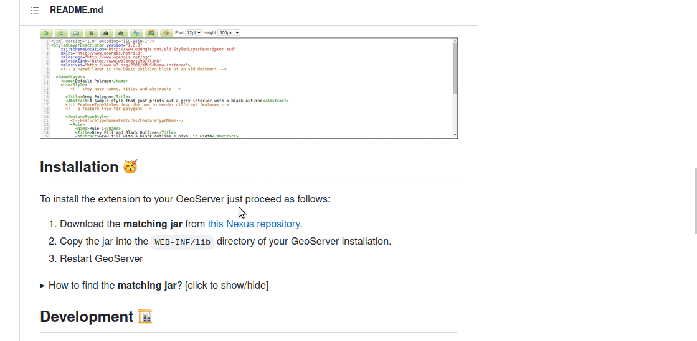

# GeoStyler GeoServer extension

This extension integrates the GeoStyler UI into the GeoServer styles tab.


## Installation 🥳

To install the extension to your GeoServer just proceed as follows:

1. Download the **matching jar** from [this Nexus repository](https://nexus.terrestris.de/#browse/browse:geoserver-extras:org%2Fgeoserver%2Fcommunity%2Fgs-geostyler).
2. Copy the jar into the `WEB-INF/lib` directory of your GeoServer installation. 
3. Restart GeoServer

<details>
  <summary>How to find the <strong>matching jar</strong>? <small>[click to show/hide]</small></summary><p>
  <ul>
  <li>The link will lead you to the list of all published artefacts of the plugin, organized in a directory
structure</li>
  <li>below <code>org/geoserver/community/gs-geostyler</code> you will find packages for several versions of GeoStyler, e.g. <code>1.2.0</code>, <code>1.2.1</code> or <code>1.2.2</code>
  <li>Choose the highest version, e.g. <code>1.2.2</code>, and click on the version. A subfolder will be shown</li>
  <li>You will need to download a version that is compatible to your GeoServer version, e.g. <code>2.22.2</code></li>
  <li>The jars are named according to the following scheme: <code>gs-geostyler-[[GeoStyler-version]]-[[GeoServer-version]].jar</code></li>
  <li>So for the example versions above, the matching jar would be <code>gs-geostyler-1.2.2-2.22.2.jar</code>, since
  the needed <code>[[GeoStyler-version]]</code> is <code>1.2.2</code> and the target <code>[[GeoServer-version]]</code> is <code>2.22.2</code>
  
  </p>
</details>

## Development 🏗️

Basically the plugin just includes the JavaScript resources of the GeoStyler into
a Wicket page which in turn will be rendered by the GeoServer. The lib files aren't
part of the repository and need to be packed into the plugin during build. To build
the plugin (including the JS sources), just execute:

```
mvn clean package
```

This will create a `gs-geostyler-<VERSION>-<GEOSERVER_VERSION>.jar` file inside the `target` directory
which can be copied to the GeoServer's lib directory. For testing purposes this
repository contains a dockerized GeoServer:

1. Copy the freshly created jar into the lib directory:

```
cp ./target/gs-geostyler-<VERSION>.jar ./docker/geoserver/additional_libs
```

2. Run GeoServer:

```
docker-compose up --build --force-recreate --remove-orphans
```

## Release 📰

Uses the @terrestris/maven-semantic-release plugin to create new releases automatically.

## <a name="funding"></a>Funding & financial sponsorship

Maintenance and further development of this code can be funded through the
[GeoStyler Open Collective](https://opencollective.com/geostyler). All contributions and
expenses can transparently be reviewed by anyone; you see what we use the donated money for.
Thank you for any financial support you give the GeoStyler project 💞

