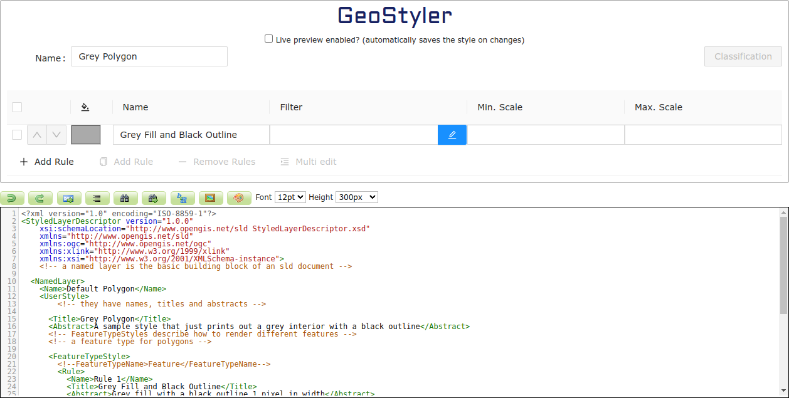

# GeoStyler GeoServer extension

This extension integrates the GeoStyler UI into the GeoServer styles tab.




## Installation 🥳

To install the extension to your GeoServer just proceed as follows:

1. Go to the [releases page](https://github.com/geostyler/geostyler-geoserver-plugin/releases) and
   find a matching version (usually the [latest](https://github.com/geostyler/geostyler-geoserver-plugin/releases/latest)).
1. Download the <code>gs-geostyler-[[GeoStyler-version]]-[[GeoServer-version]].zip</code>
1. Extract the contents to your `WEB-INF/lib` directory of your GeoServer installation.
1. Restart GeoServer.

## Maven artifact

Additionally the build artifacts are also available in a [Nexus repository](https://nexus.terrestris.de/#browse/browse:geoserver-extras:org%2Fgeoserver%2Fcommunity%2Fgs-geostyler) e.g. to be included in custom builds.

## Development 🏗️

Basically the plugin just includes the JavaScript resources of the GeoStyler into
a Wicket page which in turn will be rendered by the GeoServer. The lib files aren't
part of the repository and need to be packed into the plugin during build. To build
the plugin (including the JS sources), just execute:

```
mvn clean package
```

This will create a `gs-geostyler-<VERSION>-<GEOSERVER_VERSION>.jar` file inside the `target` directory
which can be copied to the GeoServer's lib directory. For testing purposes this
repository contains a dockerized GeoServer:

1. Copy the freshly created jar into the lib directory:

```
cp ./target/gs-geostyler-<VERSION>.jar ./docker/geoserver/additional_libs
```

1. Navigate to the `docker` directory and run GeoServer:

```
cd docker
docker compose up --build --force-recreate --remove-orphans
```

1. Open [http://localhost:8080/geoserver](http://localhost:8080/geoserver) and log in via `admin:geoserver`.

## Release 📰

Uses the [@terrestris/maven-semantic-release](https://github.com/terrestris/maven-semantic-release) plugin to create new releases automatically.

## <a name="funding"></a>Funding & financial sponsorship

Maintenance and further development of this code can be funded through the
[GeoStyler Open Collective](https://opencollective.com/geostyler). All contributions and
expenses can transparently be reviewed by anyone; you see what we use the donated money for.
Thank you for any financial support you give the GeoStyler project 💞
